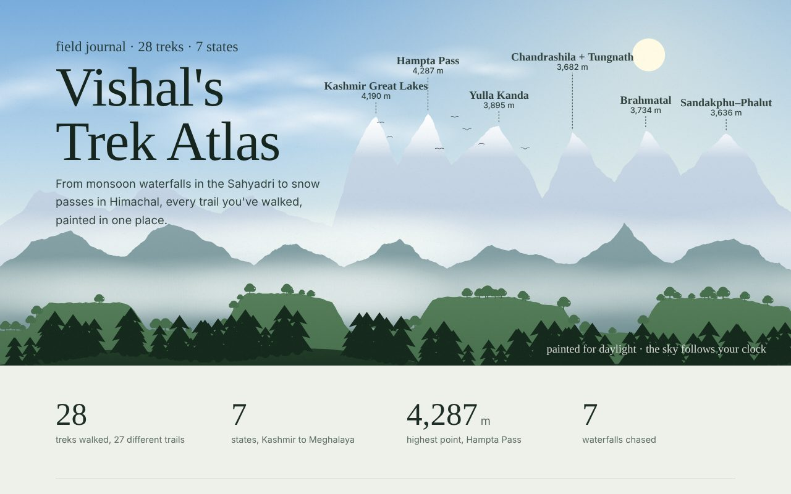
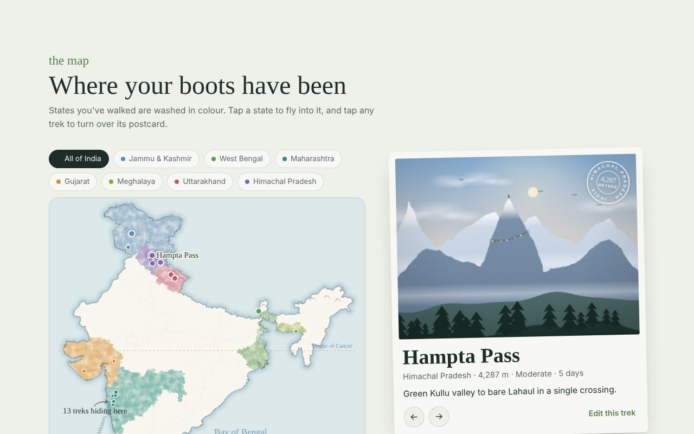
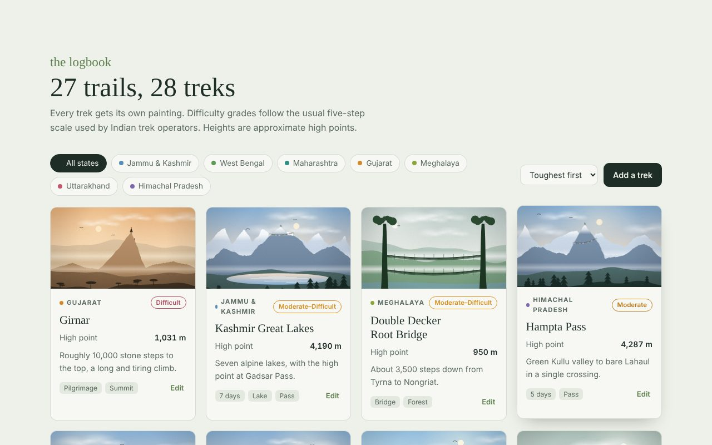

# Vishal's Trek Atlas

My treks across India, kept as a hand-painted field journal instead of a spreadsheet.

**Live site: https://vishal-1211.github.io/trek-atlas/**



## What's inside

- **A landscape that follows the clock.** The opening painting changes with the time of day: dawn, daylight, dusk, and a moonlit night sky. My highest treks are named on the ridgeline.
- **A watercolour map of India.** Every state I've walked is washed in its own colour, with dotted trails joining the treks. Tap a state to fly into it.
- **A painted postcard for every trek.** Each scene is drawn to match the place: Sahyadri plateaus and monsoon waterfalls, Himalayan passes with prayer flags, alpine lakes, the living root bridge in Meghalaya.
- **A cairn.** One stone per trek, sized by its high point.
- **Rucksack patches.** Badges such as 4,000 m Club and Waterfall Chaser that are earned automatically as treks are logged.
- **A logbook.** Filter by state, sort, add a trek, or edit one.





## The treks so far

28 treks across 7 states.

| State | Treks |
| --- | --- |
| Jammu & Kashmir | Kashmir Great Lakes, Vaishno Devi |
| Himachal Pradesh | Hampta Pass, Yulla Kanda, Jalori Pass 360°, Bijli Mahadev, Chhoie Waterfall |
| Uttarakhand | Brahmatal, Chandrashila + Tungnath, Deoria Tal |
| West Bengal | Sandakphu–Phalut |
| Meghalaya | Wei Sawdong, Double Decker Root Bridge |
| Gujarat | Girnar, Pavagadh |
| Maharashtra | Kalsubai (twice), Lohgad, Visapur, Duke's Nose, Naneghat, Andharban, Adrai Jungle Trek, Devkund Waterfall, Hidden Summer Waterfall (Khopoli), Hidden Monsoon Waterfall (Murbad), Blue Lagoon Waterfall (Murbad), Karjat Secret Waterfall Rappel |

### By difficulty

| Grade | Treks |
| --- | --- |
| Difficult | Girnar |
| Moderate–Difficult | Kashmir Great Lakes, Double Decker Root Bridge |
| Moderate | Hampta Pass, Chandrashila + Tungnath, Sandakphu–Phalut, Chhoie Waterfall, Kalsubai, Devkund Waterfall, Karjat Secret Waterfall Rappel |
| Easy–Moderate | Yulla Kanda, Brahmatal, Jalori Pass 360°, Vaishno Devi, Wei Sawdong, Visapur, Duke's Nose, Naneghat, Andharban |
| Easy | Bijli Mahadev, Deoria Tal, Lohgad, Pavagadh, Adrai Jungle Trek, and the three hidden waterfalls near Khopoli and Murbad |

Grades follow the five-step scale Indian trek operators use, checked against operator and guide pages. Altitudes and map positions are approximate.

## How it works

The whole site is one file, `index.html`. There is no build step, no server and no database.

- The paintings, the map and the cairn are drawn in the browser with Canvas and SVG. No image files are used.
- The trek list lives in the `BASE` array near the top of the script in `index.html`. Each trek has a name, state, high point, coordinates, difficulty, tags and a note.
- The tags decide what gets painted. `Waterfall`, `Fort`, `Pass`, `Lake`, `Pilgrimage`, `Forest`, `Bridge` and `Rappelling` each add something to the scene.
- Fonts (Gloock, Figtree, Caveat) load from Google Fonts. Everything else is inside the file.

## Adding a trek

**For everyone who visits the site:** add an entry to the `BASE` array in `index.html` and commit. GitHub Pages republishes in about a minute.

```js
{n:"Kedarkantha", s:"Uttarakhand", alt:3800, lat:31.02, lon:78.17, d:"Moderate", days:5, tags:["Summit"], note:"Winter summit above Sankri."},
```

**Just in your own browser:** use the **Add a trek** button on the site. Those edits are saved in that browser only. Use **Copy backup** to move them elsewhere.

## Running it locally

Download `index.html` and open it in any browser.

## Credits

- India and state outlines: Survey of India boundaries, via [DataMeet](https://github.com/datameet/maps).
- Built with [Claude](https://claude.ai).

## Licence

The code is released under the [MIT licence](LICENSE). The map outlines come from DataMeet and keep their own terms.
